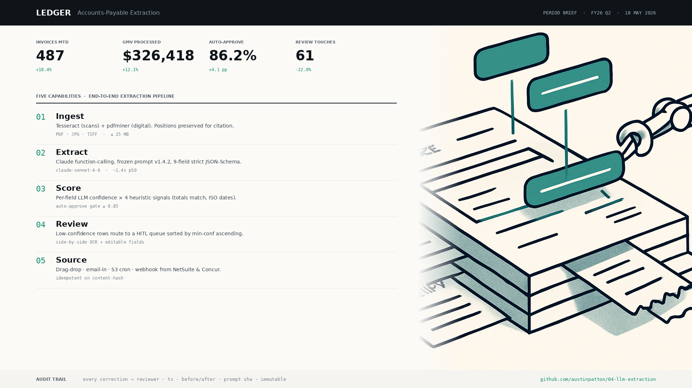
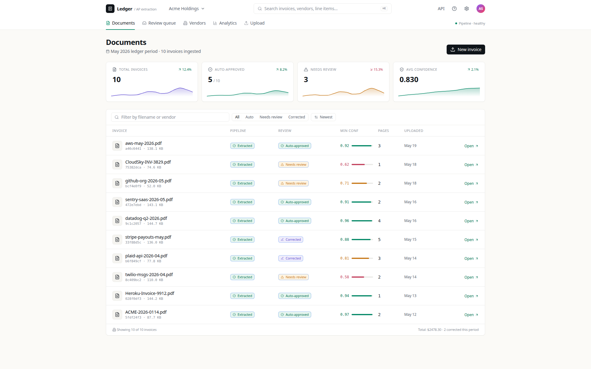
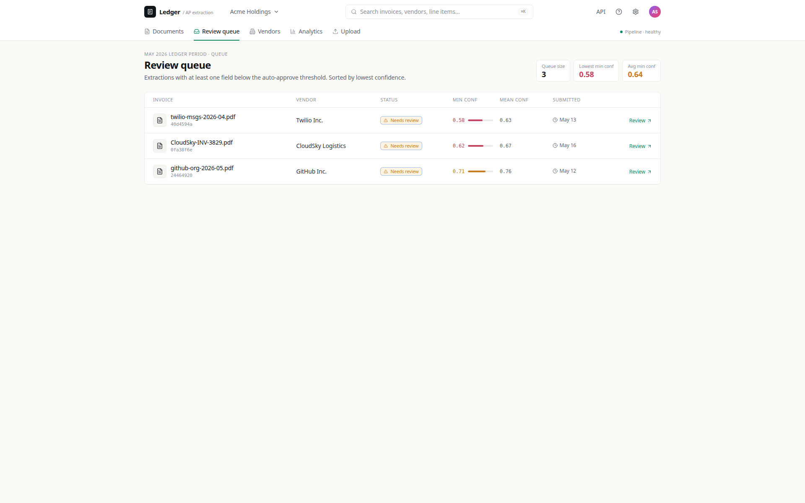
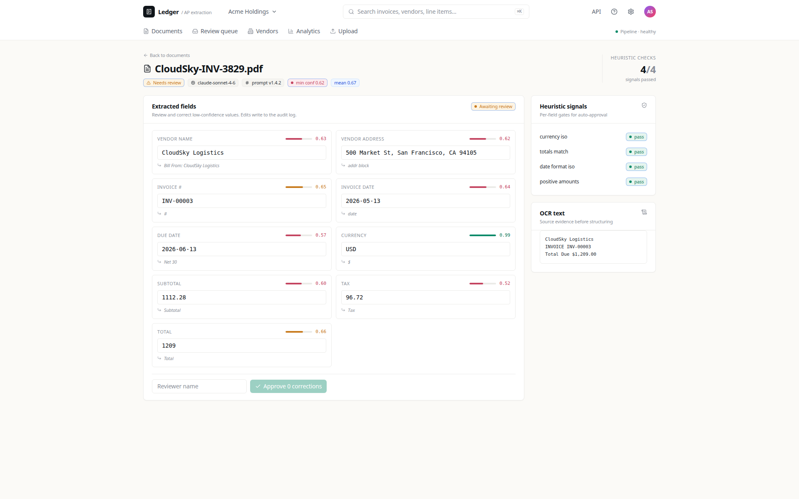
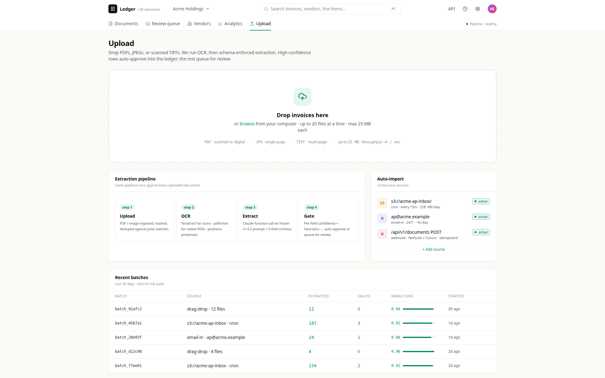
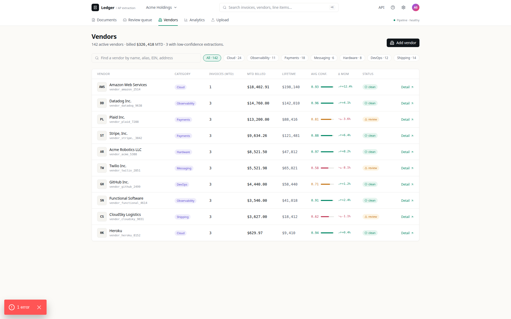
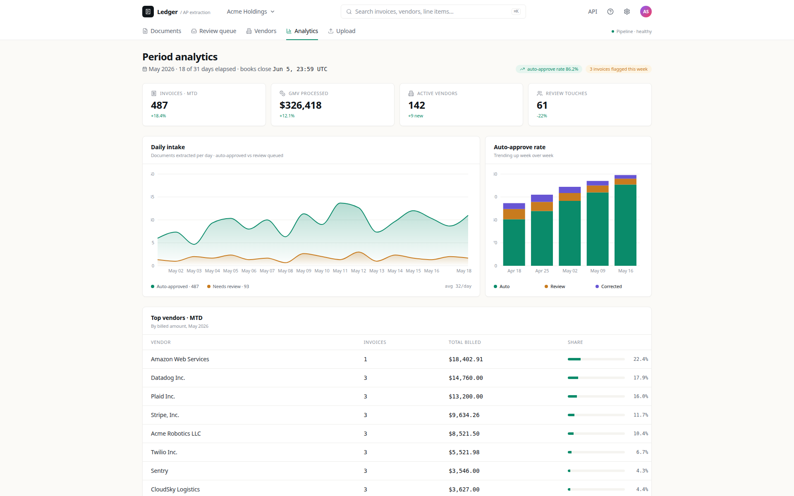

<div align="center">

# Ledger — Schema-Enforced LLM Invoice Extraction

**PDF → OCR → Claude function-calling → 9-field JSON-Schema → per-field confidence → human-in-the-loop review → immutable audit log.**



[](https://www.python.org/)
[](https://fastapi.tiangolo.com/)
[](https://docs.celeryq.dev/)
[](https://www.postgresql.org/)
[](https://www.anthropic.com/)
[](LICENSE)

</div>

## What it does

Ledger ingests invoices (PDF, JPEG, TIFF) via **HTTP upload / drag-drop**, runs hybrid OCR (`pypdf` first for digital PDFs; `pdf2image` + `pytesseract` fallback when text extraction yields fewer than 200 characters), then a **forced Claude function-call** (`tool_choice` pinned to `record_invoice`) extracts a strict 9-field invoice schema (vendor, invoice number, dates, line items, totals).

Each field carries an LLM confidence × 4 heuristic signals (totals match, ISO dates, ISO currency, positive amounts). **High-confidence rows auto-approve** into the ledger; the rest queue for human review in a side-by-side OCR + editable-fields UI. **Every correction lands in an immutable audit log** — replayable to restore prior extraction state.

## Features

- **Hybrid OCR** — `pdf2image` rasterises scanned pages for Tesseract; `pypdf` parses digital PDFs natively; text positions preserved so the reviewer sees what the LLM saw.
- **Schema-enforced extraction** — Claude function-calling with forced `tool_choice`, *frozen* prompt versions (`v1` and `v2`; v2 adds anti-hallucination rules requiring verbatim evidence) and a strict 9-field JSON-Schema validated by Pydantic; malformed outputs raise an `ExtractionError` and retry rather than reaching the database.
- **Per-field confidence + heuristic gate** — auto-approve threshold ≥ 0.85; below that rows queue for human review.
- **HITL review queue** — sorted by `min_confidence` ascending so the most-uncertain extractions surface first; one-click corrections.
- **Immutable audit log** — every correction stored with reviewer id, timestamp, before/after JSON, and prompt SHA. Reproduce or roll back any prior extraction.

## Screenshots

<table>
<tr>
<td width="50%"></td>
<td width="50%"></td>
</tr>
<tr>
<td></td>
<td></td>
</tr>
<tr>
<td></td>
<td></td>
</tr>
</table>

## Stack

| Layer       | Tech |
|-------------|------|
| Backend     | Python 3.11, FastAPI, Pydantic 2, SQLAlchemy 2 + asyncpg, Alembic |
| Queue       | Celery + Redis broker; idempotent on content-hash |
| OCR         | `pdf2image` + `pytesseract` (scans), `pypdf` (digital), Pillow |
| Extraction  | Anthropic Claude function-calling (forced `tool_choice`), 9-field strict JSON-Schema, frozen prompt versions (`v1` baseline / `v2` anti-hallucination) |
| Storage     | Postgres 16; tables `documents`, `extractions`, `reviews`, `audit_log` |
| Frontend    | Next.js 14, TypeScript, Tailwind, Recharts |
| Ops         | Docker Compose, structlog, Tenacity retries |

## Run locally

```bash
git clone https://github.com/vltech55/ledger-extract
cd ledger-extract
cp .env.example .env       # add ANTHROPIC_API_KEY
docker compose up -d --build
docker compose exec backend alembic upgrade head
docker compose exec backend python -m scripts.seed_samples   # 5 sample invoices
```

Open <http://localhost:3000> for the dashboard. Upload more invoices via drag-drop or `curl -F file=@invoice.pdf http://localhost:8000/documents`.

## Architecture

```
       ┌──────────┐
upload │ HTTP/    │
       │ drag-drop│──────┐
       │ (dedup on │      │
       │  SHA-256) │      │
       └──────────┘      │
                         ▼
                  ┌──────────────┐         ┌──────────────┐
                  │ Celery task  │────────▶│ pdf2image +  │
                  │ on Redis     │         │ pytesseract  │  (or pypdf for digital)
                  └──────┬───────┘         └──────┬───────┘
                         │                         │
                         │                  ┌──────▼──────┐
                         │                  │  OCR text   │
                         │                  └──────┬──────┘
                         │                         │
                         │                ┌────────▼───────────┐
                         │                │ Claude function-   │
                         │                │ call · v1/v2 pin   │
                         │                │ 9-field JSON-Schema│
                         │                └────────┬───────────┘
                         │                         │
                         │                  ┌──────▼─────────┐
                         │                  │ confidence × 4 │
                         │                  │ heuristic gate │
                         │                  └──────┬─────────┘
                         │                         │
                ┌────────┴──────┐        ┌────────▼─────────┐
                │ auto-approve? │ ──no──▶│  HITL review     │
                └────────┬──────┘        │  queue           │
                         │ yes           └────────┬─────────┘
                         │                        │
                         ▼                        ▼
                  ┌────────────┐           ┌─────────────┐
                  │ ledger row │           │  audit_log  │
                  └────────────┘           │ (immutable) │
                                            └─────────────┘
```

## Tests

```bash
docker compose exec backend pytest
```

Includes tests for the prompt pinning, JSON-Schema strict-mode rejection, heuristic confidence calculation, and audit-log immutability.

## License

MIT
