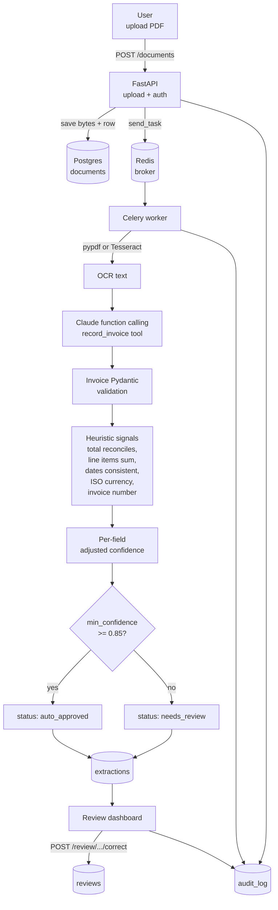

# Architecture



## Why Celery instead of in-process background tasks

OCR + LLM extraction on a multi-page invoice takes seconds, not milliseconds.
Doing this in a FastAPI background task ties up an event loop and prevents
horizontal scaling. With Celery, workers are independently scalable
(`--concurrency=N`), retries are first-class (`task_max_retries`), and the
broker (Redis) absorbs traffic spikes.

`task_acks_late=True` plus `worker_prefetch_multiplier=1` means a worker
acknowledges a task only after success — a crash mid-OCR returns the task
to the queue.

## Per-field confidence: two independent signals

The hard part of LLM extraction in production isn't "did we extract a value",
it's "can we trust the value enough to act on it". This system blends two
signals:

1. **LLM self-confidence**: the `record_invoice` tool schema requires
   `confidence` and `evidence` on every field. The prompt explicitly
   calibrates the scale (0.95+ verbatim, 0.7 inferred-unambiguous, 0.4
   guess-from-context, 0.0 fabricated). Evidence is required to be a
   verbatim substring of the OCR text.

2. **Heuristic signals**: independent checks that don't rely on the LLM:
   - `subtotal + tax ≈ total` (relative tolerance 2%)
   - `sum(line_total) ≈ subtotal`
   - `due_date >= invoice_date` (and both parse)
   - Currency is a recognized ISO 4217 code from a small allowlist
   - Invoice number matches a sane alphanumeric pattern

The blend formula is **monotone non-decreasing in heuristic agreement**:
`adjusted = min(1, llm_conf + boost)` where `boost` grows with the fraction
of relevant signals that agree. A failing heuristic never *lowers* confidence
on its own — that would punish the model for noisy OCR — but agreement
*raises* it. Auto-approve threshold defaults to 0.85.

## Prompt versioning + regression eval

Each prompt is a frozen `PromptVersion(version, system, notes)` in
`extract/prompts.py`. Extractions record which version produced them, so
A/B comparison happens at query time:

```sql
SELECT prompt_version, AVG(min_confidence)
FROM extractions GROUP BY prompt_version;
```

The bundled `seed_samples.py` generates 5 deterministic invoice PDFs with
known ground truth. The `/eval/regression` endpoint runs the current
prompt over each, compares extracted to ground truth field-by-field, and
returns a mean correctness score. This is the safety net before promoting
a prompt change to production.

## Audit trail

Every state transition writes an `audit_log` row:

| entity_type  | action            | actor    |
| ------------ | ----------------- | -------- |
| document     | uploaded          | api      |
| document     | processing        | worker   |
| document     | extracted         | worker   |
| document     | ocr_failed        | worker   |
| document     | extract_failed    | worker   |
| extraction   | reviewed          | reviewer |

The log is append-only and indexed by `(entity_type, entity_id, created_at)`,
so reconstructing a document's full history is a single query.
